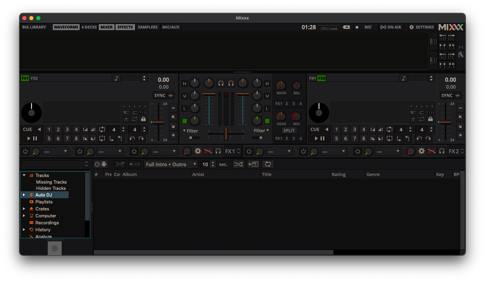

# M1xxx

[](https://github.com/fwcd/m1xxx/actions/workflows/build.yml)

> **Note**: Official snapshot builds of Mixxx for Apple Silicon are now available for download [here](https://mixxx.org/download/#testing). These are recommended for most users and can also be installed via Homebrew:
> ```bash
> brew tap homebrew/cask-versions
> brew install --cask mixxx-snapshot
> ```

Unofficial Apple Silicon (arm64 macOS) builds of the free and open source DJ software [Mixxx](https://mixxx.org/).



## Installation

[Get the most recent binaries from GitHub Releases here.](https://github.com/fwcd/m1xxx/releases)

Alternatively you can install `m1xxx` via [Homebrew](https://brew.sh/) using

```sh
brew tap fwcd/fwcd
brew install --cask m1xxx
```

This has the additional advantage of making it easy to upgrade or remove `m1xxx`.

## Background

Mixxx traditionally only provided builds for x86-64 macOS. While these run fine under Rosetta 2, native Mixxx builds for arm64 run at roughly half the CPU load and feel noticeably more snappy than the x86-64 version.

This repo provides native builds for arm64 that are cross-compiled from GitHub's x86-64 Actions runners.

## Upstreaming process

Both the `mixxx` and the `vcpkg` branch now use the official upstream revisions.

## Building natively on Apple Silicon (arm64 macOS) hosts

While the CI workflows in this repo mainly deal with the case of cross-compiling Mixxx from x86-64 macOS runners to arm64, it is also possible to compile directly from an arm64 macOS (Apple Silicon) host.

First, make sure to have Homebrew installed and the submodules in this repo checked out (using `git submodule update`). To install the system dependencies, run:

```sh
scripts/install-macos-deps
```

To compile and install Mixxx's dependencies into `vcpkg` run:

```sh
scripts/bootstrap-vcpkg
scripts/install-vcpkg-deps
```

> Note: If vcpkg produces a 'missing Python' error message, make sure to have `python` on your PATH, e.g. by symlinking it to `python3` with `ln -s /opt/homebrew/bin/python3 /usr/local/bin/python`.

To build Mixxx, run:

```sh
scripts/configure-mixxx
scripts/build-mixxx
```

## Building for iOS (WIP)

> **Note:** These instructions are not fully tested yet and may still cause build failures.

To build for iOS, install the system dependencies as above, make sure the submodules are checked out and install the dependencies by running:

```sh
scripts/bootstrap-vcpkg
scripts/install-vcpkg-deps --target arm64-ios-release
```

> [!TIP]
> You can also (experimentally) build with Qt 5 using
> ```sh
> scripts/install-vcpkg-deps --qt5 --target arm64-ios-release
> ```

To configure Mixxx, run:

```sh
scripts/configure-mixxx --target arm64-ios-release
```

> [!TIP]
> To (experimentally) build with Qt 5, set `--qt5`

The Xcode project at `build/mixxx.xcodeproj` should then contain an iOS target for Mixxx.

## Credits

Thanks to [`daschuer`](https://github.com/daschuer) for the work involved in backporting the relevant Qt patches, parts of the CI workflows and assistance in building the dependencies!
